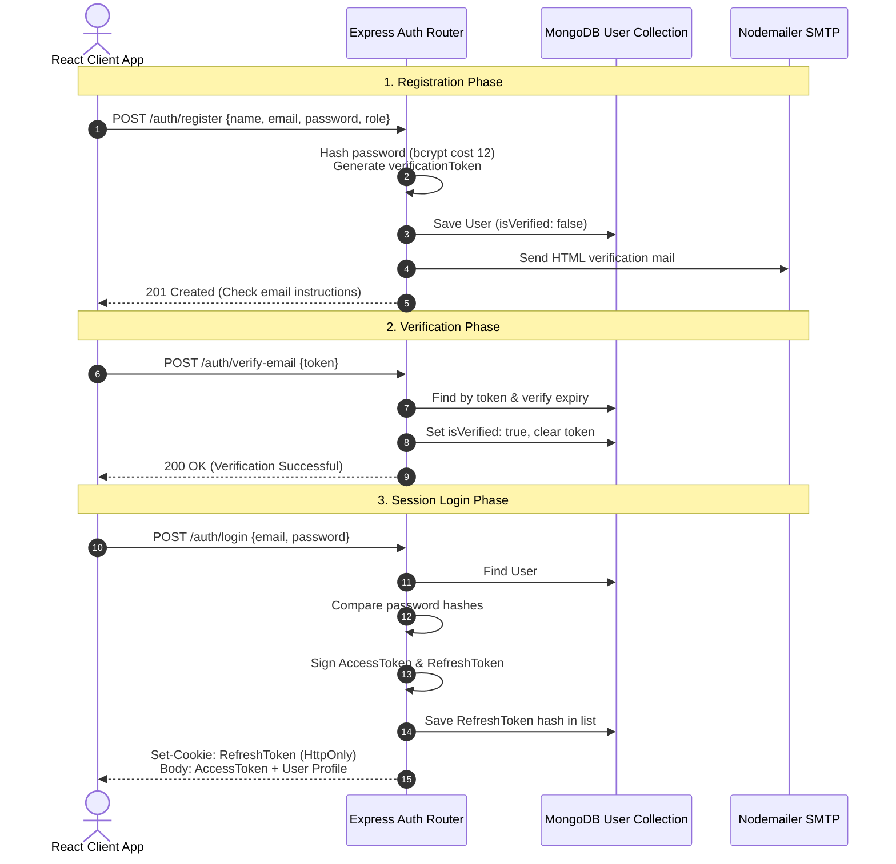

# Authentication & Authorization Architecture

This document specifies the complete authentication and authorization architecture for the **ResQNet** platform. It defines a secure token-based scheme leveraging JWTs, refresh tokens, role-based controls, email verification, and recovery mechanisms.

---

### 1. Authentication Flow
ResQNet implements a dual-token authentication scheme consisting of short-lived Access Tokens and long-lived Refresh Tokens.

*   **Access Token:**
    *   **Lifetime:** 15 minutes.
    *   **Transmission:** Sent in the HTTP `Authorization` header as `Bearer <token>`.
    *   **Storage:** Stored in client memory (React context/state) to prevent Cross-Site Scripting (XSS) extraction.
*   **Refresh Token:**
    *   **Lifetime:** 7 days.
    *   **Transmission:** Exchanged via `Set-Cookie` headers.
    *   **Storage:** Securely persisted on the client browser in an `HttpOnly`, `Secure`, `SameSite=Strict` cookie restricted to the `/api/v1/auth/refresh` path.
    *   **Rotation:** ResQNet uses Refresh Token Rotation (RTR). Every time a refresh request is made, the old refresh token is invalidated, and a new one is returned.

---

### 2. Registration Flow
1.  **Client Submission:** The user submits `{ name, email, password, phone, role }` through the signup form.
2.  **Server Input Validation:** The server runs format validation checks on standard inputs (e.g. valid email syntax, password strength).
3.  **Unique Checks:** The server queries MongoDB to confirm the email is not registered.
4.  **Credential Protection:** The password is encrypted using `bcrypt` with a work cost of `12` rounds.
5.  **Activation Generation:** The server creates a cryptographically secure random verification token (hex) and logs its expiry time (+24 hours).
6.  **Pending Save:** The user document is written with status set to `PendingVerification`.
7.  **Delivery Check:** Nodemailer dispatches an HTML email containing a link with the verification token: `https://resqnet.org/verify-email?token=<token>`.

---

### 3. Login Flow
1.  **Submission:** User provides credentials `{ email, password }`.
2.  **Verification Check:** Server checks the account. If `isVerified` is false, it returns `403 Forbidden` with verification required instructions.
3.  **Hash Match:** Bcrypt compares the request password against the hashed database value.
4.  **Token Issuance:** If valid, the server:
    *   Generates an Access Token and sets its expiration.
    *   Generates a Refresh Token, hashes it, and saves the hash along with expiry details inside the user's `refreshTokens` array in the database.
    *   Sets the plaintext Refresh Token in an HttpOnly cookie.
    *   Returns the Access Token and the User profile metadata in the response body.

---

### 4. Email Verification Flow
1.  **Link Interaction:** User clicks the link in their email.
2.  **State Transit:** The React app reads the query token and sends `POST /api/v1/auth/verify-email` with the token.
3.  **Server Verification:** The server searches for the user by `verificationToken`, checks if `verificationTokenExpires` is greater than the current time, flags `isVerified = true`, and clears the token parameters.

---

### 5. Forgot Password Flow
1.  **Request:** User inputs their email on the recovery screen.
2.  **Generation:** The server checks if the user exists. If yes, it creates a `passwordResetToken` (random hex) with a short expiry (+1 hour).
3.  **Transmission:** Saves tokens to the user document and sends an email via SMTP containing `https://resqnet.org/reset-password?token=<token>`.

---

### 6. Reset Password Flow
1.  **Submission:** User enters their new password and submits it alongside the verification token.
2.  **Verification:** Server matches the token and verifies it has not expired.
3.  **Update:** Server encrypts the new password with bcrypt, clears token fields, and **wipes the `refreshTokens` whitelist** from the database to force log out of all active devices.

---

### 7. Refresh Token Flow (Security & Rotation)
1.  **Expiration Catch:** If the Access Token expires, the client calls `POST /api/v1/auth/refresh`.
2.  **Cookie Evaluation:** The server extracts the refresh token from the HttpOnly cookie, hashes it, and searches the database for a matching record in any user's `refreshTokens` array.
3.  **Attack Detection:**
    *   If the token has already been marked as used (re-use check), the server assumes a replay attack has occurred. It immediately **clears all refresh tokens** for that user, locking out all active sessions, and returns `401 Unauthorized`.
4.  **Rotation Output:** If valid and unused, the server generates a new Access Token and rotates the Refresh Token:
    *   Saves the new refresh token's hash to the user's session record.
    *   Flags the old refresh token as revoked.
    *   Sets the new Refresh Token in the HttpOnly cookie.
    *   Returns the new Access Token.

---

### 8. JWT Strategy Specification

#### 8.1 Signature
Signed using HMAC SHA256. Secret keys are configured as environmental variables on the server.

#### 8.2 Header
```json
{
  "alg": "HS256",
  "typ": "JWT"
}
```

#### 8.3 Payload
```json
{
  "sub": "65b98f24c0ef7c234a5d89f2", // MongoDB ObjectId
  "role": "Volunteer",                // Current verified role
  "isVerified": true,                 // Email verification status
  "iat": 1783478400,                  // Issued at timestamp
  "exp": 1783479300                   // Expires at timestamp (+15 minutes)
}
```

---

### 9. Role-Based Access Control (RBAC)

Below is the permission matrix dictating feature access control:

| Endpoint Resource | Citizen | Volunteer | Dispatcher | Hospital | Admin |
| :--- | :---: | :---: | :---: | :---: | :---: |
| `POST /incidents` (Report SOS) | **Yes** | **Yes** | **Yes** | **Yes** | **Yes** |
| `GET /incidents` (View Queue) | No | **Yes** (Nearby Only) | **Yes** (All) | **Yes** (Read Only) | **Yes** |
| `PATCH /incidents/:id/assign` | No | No | **Yes** | No | **Yes** |
| `PATCH /incidents/:id/status` | No | **Yes** (Assigned) | **Yes** | No | **Yes** |
| `PATCH /shelters/:id/occupancy` | No | No | **Yes** | No | **Yes** |
| `PATCH /hospitals/:id/capacity` | No | No | No | **Yes** (Own) | **Yes** |
| `GET /users` (Manage Accounts) | No | No | No | No | **Yes** |

---

### 10. Required Database Fields (User Collection additions)

```typescript
{
  // Basic user details
  name: { type: String, required: true },
  email: { type: String, unique: true, required: true },
  password: { type: String, required: true },
  role: { 
    type: String, 
    enum: ['Citizen', 'Volunteer', 'Dispatcher', 'Hospital', 'Admin'], 
    default: 'Citizen' 
  },
  
  // Verification states
  isVerified: { type: Boolean, default: false },
  verificationToken: { type: String, default: null },
  verificationTokenExpires: { type: Date, default: null },

  // Recovery states
  passwordResetToken: { type: String, default: null },
  passwordResetExpires: { type: Date, default: null },

  // Session Token tracking (Refresh Token Rotation whitelist)
  refreshTokens: [{
    tokenHash: { type: String, required: true },
    expiresAt: { type: Date, required: true },
    createdAt: { type: Date, default: Date.now }
  }]
}
```

---

### 11. Required Middleware

*   `authenticateJWT`:
    *   Extracts header token. Decodes signature.
    *   Sets `req.user` payload if valid.
    *   Throws `401 Unauthorized` if expired or corrupted.
*   `requireRole(allowedRoles: string[])`:
    *   Compares `req.user.role` against the input array list.
    *   Throws `403 Forbidden` if missing required privileges.
*   `requireVerified`:
    *   Checks if `req.user.isVerified` is true.
    *   Throws `403 Forbidden` (Verification Required) if false.

---

### 12. API Endpoints

*   `POST /api/v1/auth/register` - Registers account (Unauthenticated).
*   `POST /api/v1/auth/login` - Authenticates user & issues cookies (Unauthenticated).
*   `POST /api/v1/auth/logout` - Clears matching token and cookie (Authenticated).
*   `POST /api/v1/auth/refresh` - Refresh access token via HttpOnly Cookie (Unauthenticated/Cookie Required).
*   `POST /api/v1/auth/verify-email` - Verifies account status. Payload: `{ token }` (Unauthenticated).
*   `POST /api/v1/auth/forgot-password` - Trigger password reset mail. Payload: `{ email }` (Unauthenticated).
*   `POST /api/v1/auth/reset-password` - Resets credential. Payload: `{ token, newPassword }` (Unauthenticated).

---

### 13. Folder Structure Setup (Auth additions)

```
server/src/
├── controllers/
│   └── auth.controller.ts        # Handlers for login, register, reset, verify
├── middleware/
│   ├── auth.middleware.ts        # authenticateJWT, requireVerified middlewares
│   └── rbac.middleware.ts        # requireRole implementation
├── routes/
│   └── auth.routes.ts            # Maps endpoints to auth controller functions
└── services/
    ├── email.service.ts          # Wraps Nodemailer HTML template dispatches
    └── token.service.ts          # Generates Access, Refresh, and verification tokens
```

---

### 14. Security Best Practices
*   **Password Hashing:** Always use `bcrypt` or `argon2`. Never store passwords in clear text or simple MD5/SHA hashes.
*   **Token Expirations:** Access tokens expire quickly (15 minutes). Refresh tokens are rotated on every exchange to reduce the exposure window.
*   **Cookie Security Flags:** Refresh token cookies must use `HttpOnly`, `Secure` (HTTPS only), and `SameSite=Strict`.
*   **Database Revocation:** Refresh tokens are tracked via hashed keys in the database. If a user logs out, that session token is deleted. If they reset their password, all active session tokens are deleted.
*   **Strict CORS Policy:** Restrict cross-origin resource sharing strictly to the frontend origin. Do not use wildcard `*` mappings.
*   **Rate Limiting:** Protect `/login`, `/register`, and `/forgot-password` routes against brute-force attacks using rate-limiting middleware (`express-rate-limit`).

---

### 15. Authentication Sequence Diagram


